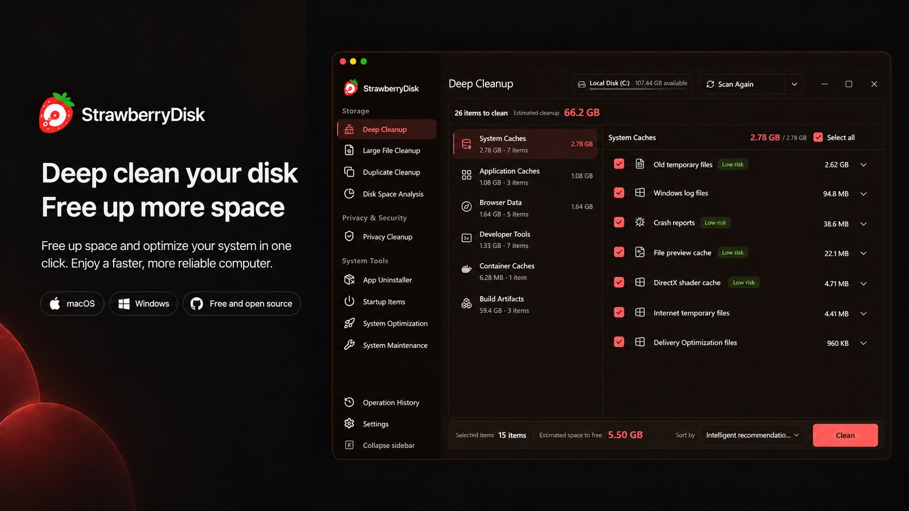
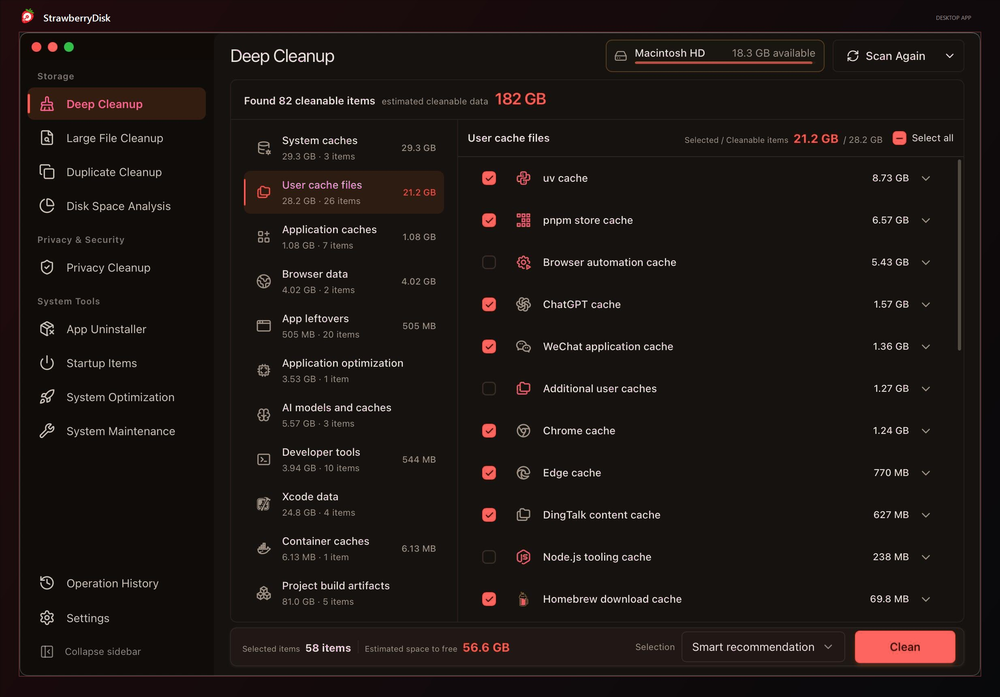
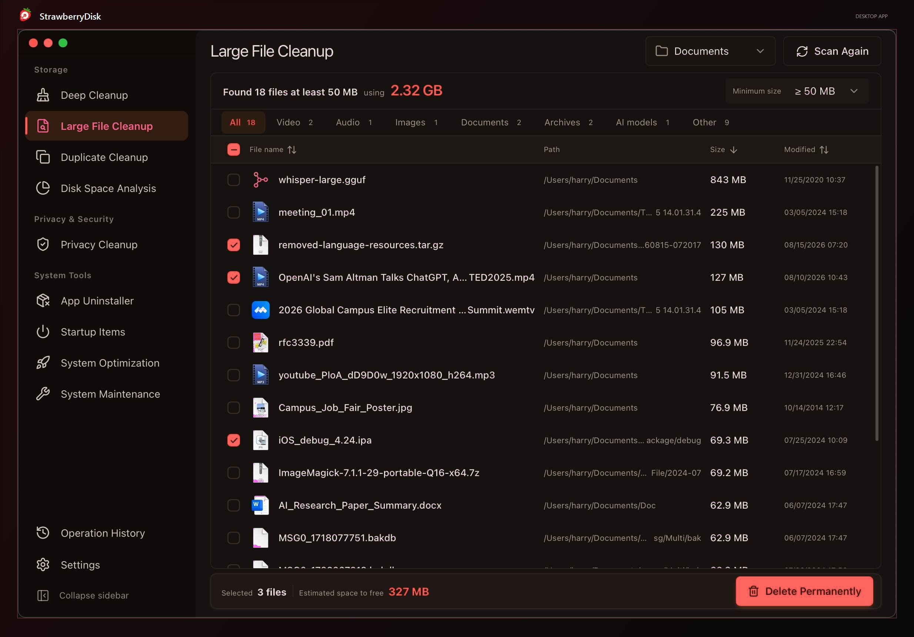
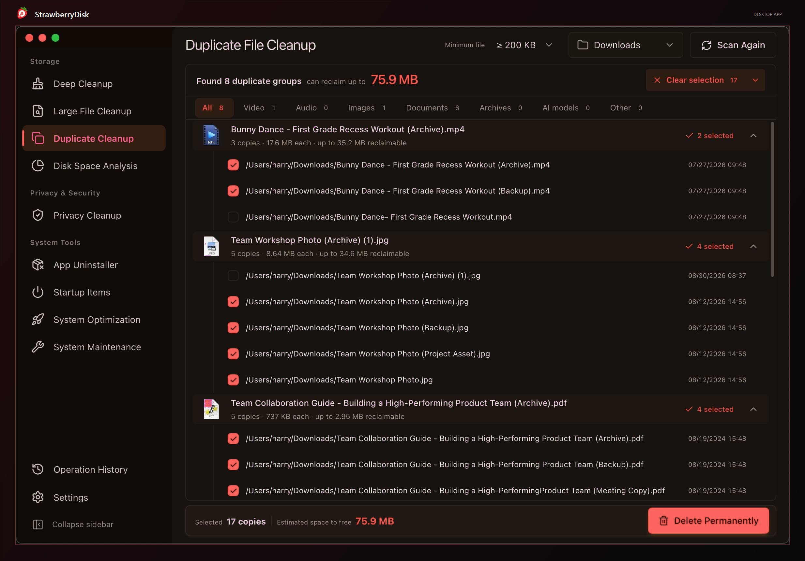
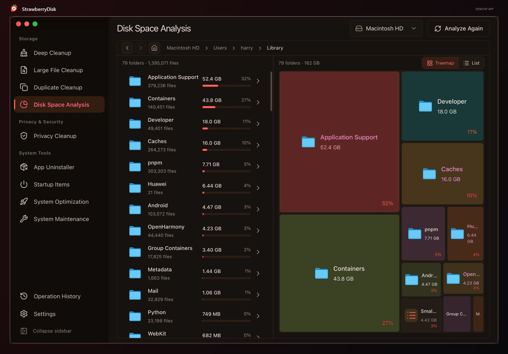
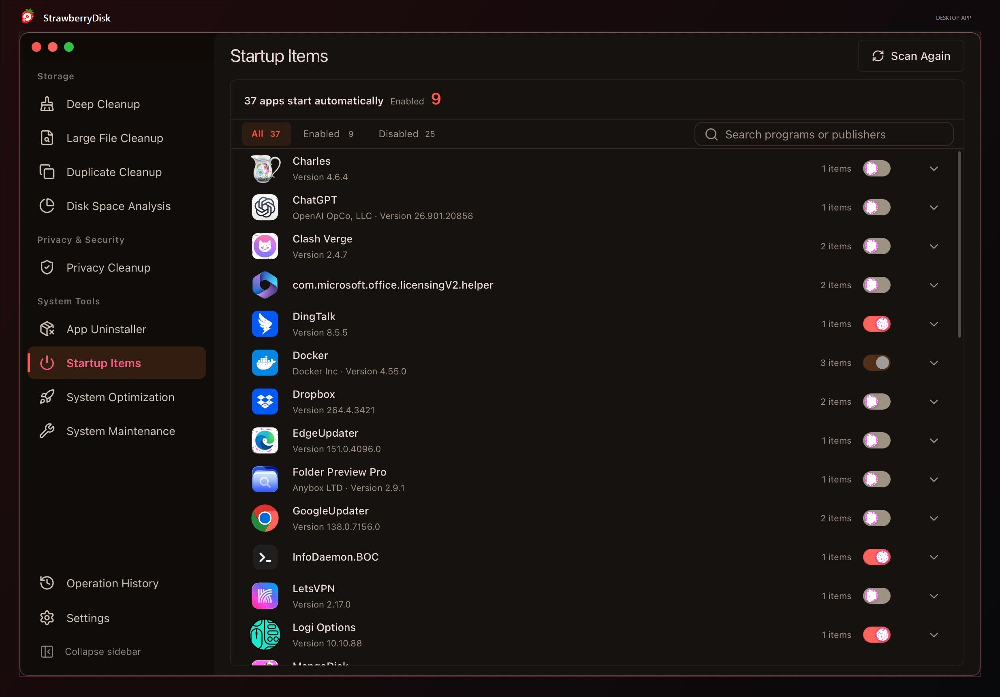
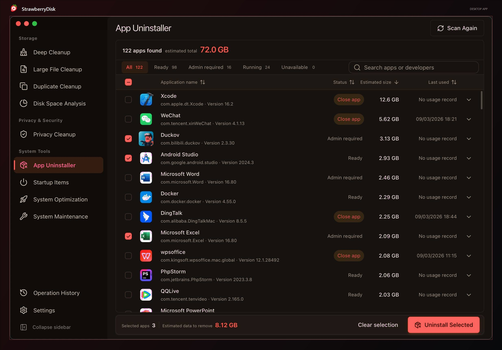
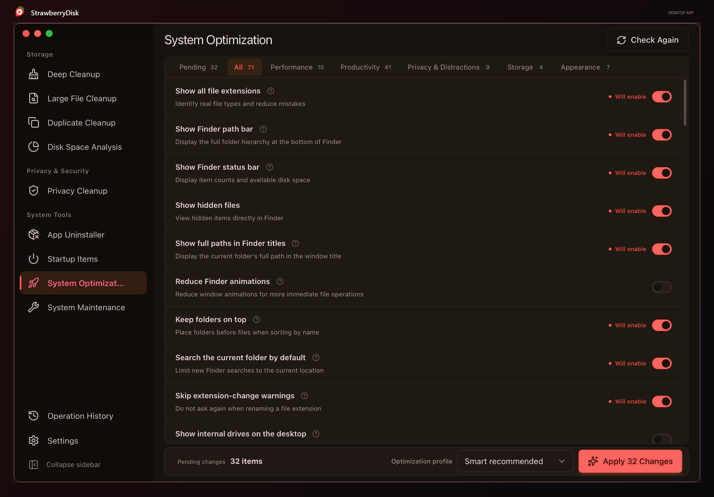
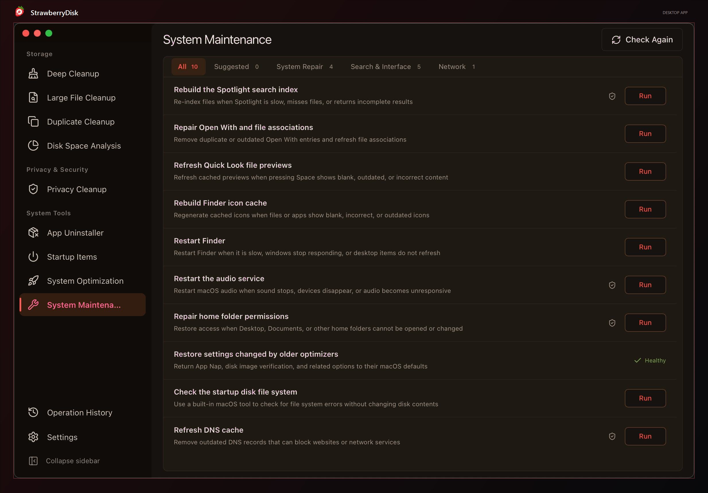
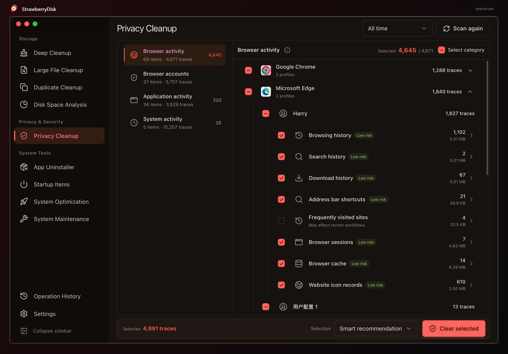

<h1 align="center">
   StrawberryDisk
</h1>

<p align="center">Disk cleanup, storage analysis, and privacy protection for <b>macOS</b>, <b>Windows</b>, and <b>Linux</b></p>

<p align="center">
  <a href="README.md">Português (Brasil)</a> · English
</p>

<p align="center">
  <a href="https://github.com/Yeake0/StrawberryDisk-updates/releases/latest"></a>
  
  
  
  
  
</p>

<p align="center">
  
</p>

## What StrawberryDisk Can Do

> **Storage**

### 1. Deep Cleanup

Find cleanable content scattered across the system, applications, developer tools, and local projects in one scan. StrawberryDisk saves you from checking each location manually and groups the results by reclaimable space:

- **System and user caches**: Reclaim space taken up over time by system temporary files, diagnostic data, and rebuildable caches.
- **Application caches**: Keep application caches, logs, update packages, and temporary content from quietly consuming more and more storage.
- **Browser data**: Reclaim space used by cached and temporary web data from Chrome, Edge, Firefox, Brave, Arc, Opera, and other browsers.
- **Developer tools and Xcode**: Quickly recover substantial storage used by package managers, IDEs, compiler caches, and Xcode development data.
- **Container caches**: Free up space used by inactive build caches and rebuildable data from Docker and other container tools.
- **Project build artifacts**: Recover space used by rebuildable dependencies, caches, and build directories across Node.js, Rust, Gradle, Swift, Python, .NET, Godot, CMake, and other projects.
- **AI models and caches**: Quickly spot large local AI models, download caches, and temporary transfer files.
- **Application optimization**: Shrink supported applications without affecting normal use, leaving more room on your disk.

Smart recommendations help you make safe choices quickly. You can also review items individually and see the estimated reclaimable space upfront, keeping every cleanup predictable and under your control.

### 2. Large File Cleanup

Quickly find the largest files and reclaim space used by old installers, videos, archives, and other bulky content without digging through folders one by one.

### 3. Duplicate File Cleanup

Reclaim space taken up by duplicate copies without treating files as duplicates just because they share a name. Smart selection keeps at least one file in every group, so cleanup stays effortless and safe.

### 4. Disk Space Analysis

See where your disk space is going at a glance. Switch between a **treemap** and a **sunburst chart**, and choose how many levels to display to explore space usage and folder structure. Browse folders alongside the file list to quickly find the largest folders and files and decide what to clean up.

> **Privacy & Security**

### 5. Privacy Cleanup

Keep browsing history, searches, cookies, recent items, and clipboard data from lingering on your computer. Clear traces left by browsers, applications, and the system to reduce exposure of your activity and make everyday privacy easier to manage.

> **System Tools**

### 6. Application Uninstall and Cleanup

Uninstall applications and clear related caches, settings, and leftovers so removing an application actually gives you the space back. Potential personal files are handled cautiously to reduce the risk of accidental deletion.

### 7. Startup Item Management

Reduce unnecessary startup delays and background resource use, so your computer starts faster and feels lighter. Turn items back on at any time when you need them again.

### 8. System Optimization

Reduce unnecessary settings that slow down your system or get in the way. Balance performance, privacy, and personal preferences so your computer feels faster and easier to use.

### 9. System Maintenance

Fix common problems like missing search results, incorrect icons, no sound, or network connection failures—without hunting down fixes or typing complex commands. Get your computer back to normal sooner.

> **Activity**

### 10. Operation History

Keep a clear record of every cleanup and system change. See how much space you recovered, what completed successfully, and whether anything still needs your attention.

## Resource Usage and Memory Management

> Available since version 1.1.1

Check CPU and memory usage, network speeds, and disk activity at a glance. See which apps use the most memory and free up memory with a click when resources are running low.

Keep these details in your menu bar, taskbar, or system tray—no need to open the main window.

## AI Explanations

> Available since version 1.1.0

Unsure what an item does or what might happen if you change it? AI explanations use the item's description and current scan results to explain its purpose and what to consider before taking action. Spend less time looking things up and make more informed choices.

Get explanations directly from items in Deep Cleanup (built-in rules), Privacy Cleanup, Startup Item Management, System Optimization, and System Maintenance.

Official releases include free explanations each day, with the option to connect your own AI service. AI offers guidance; you decide which actions to take.

## Safety and Rules

> [!IMPORTANT]
> **StrawberryDisk puts data safety ahead of reclaiming more space.**
> Cleanup rules and system optimizations only ship after their safety boundaries are clearly defined and they pass validation on real systems.

StrawberryDisk scans in read-only mode by default. Before cleanup, deletion, uninstall, or system setting changes begin, you can review and confirm exactly what will happen. Results are saved to Operation History.

System Optimization only uses built-in, validated settings. It never accepts arbitrary registry paths, terminal commands, or scripts. StrawberryDisk reads each setting again after changing it and calls out high-impact items and changes that require administrator access or a restart.

StrawberryDisk maintains its own cleanup rules. Third-party projects may provide research leads, but a candidate rule is only accepted after reliable sources, safe boundaries, and real-system behavior have been verified. Anything without a clear safety boundary is excluded.

The complete rule library and revision history are open for inspection: [view the StrawberryDisk cleanup rule library](https://github.com/Yeake0/StrawberryDisk/tree/main/src-tauri/crates/strawberrydisk-core/rules).

## Screenshots

These screenshots show the original interface and may differ from the current StrawberryDisk release.

<p align="center">
  <strong>Deep Cleanup</strong><br>
  <sub>Find cleanable content across the system, applications, developer tools, and projects to reclaim more space</sub>
</p>

<p align="center">
  
</p>

<table>
  <tr>
    <td width="50%" align="center">
      <strong>Large File Cleanup</strong><br>
      <sub>Find the files taking up the most space without digging through folders</sub><br><br>
      
    </td>
    <td width="50%" align="center">
      <strong>Duplicate File Cleanup</strong><br>
      <sub>Safely remove exact duplicates while keeping at least one copy</sub><br><br>
      
    </td>
  </tr>
  <tr>
    <td width="50%" align="center">
      <strong>Disk Space Analysis</strong><br>
      <sub>See where your storage is going and quickly find the largest files and folders</sub><br><br>
      
    </td>
    <td width="50%" align="center">
      <strong>Startup Item Management</strong><br>
      <sub>Reduce unnecessary startup programs for faster sign-in and less background activity</sub><br><br>
      
    </td>
  </tr>
  <tr>
    <td width="50%" align="center">
      <strong>Application Uninstall and Cleanup</strong><br>
      <sub>Uninstall applications and remove related leftovers to reclaim more space</sub><br><br>
      
    </td>
    <td width="50%" align="center">
      <strong>System Optimization</strong><br>
      <sub>Optimize performance, privacy, and everyday usability in one click</sub><br><br>
      
    </td>
  </tr>
  <tr>
    <td width="50%" align="center">
      <strong>System Maintenance</strong><br>
      <sub>Fix common system issues quickly and get your computer back to normal</sub><br><br>
      
    </td>
    <td width="50%" align="center">
      <strong>Privacy Cleanup</strong><br>
      <sub>Leave fewer activity traces behind and keep everyday use more private</sub><br><br>
      
    </td>
  </tr>
</table>

## Before You Begin

> [!CAUTION]
>
> 1. Cleanup, permanent deletion, and uninstall operations may not be reversible. Review the selected content and keep reliable backups of important data.
> 2. Before running system maintenance or changing a startup item or system setting, make sure you understand its purpose and impact.
> 3. Some system optimizations can affect security, privacy, battery life, or update behavior.

## Desktop App

The app supports Brazilian Portuguese and English. Saved preferences for other languages fall back to English after updating without changing other settings.

Download the [Windows x64 installer](https://github.com/Yeake0/StrawberryDisk-updates/releases/latest) from the public update channel. The corresponding source archive is included with each release. This fork does not currently publish macOS or Linux installers; you can build them from source on a compatible system.

## Command Line (CLI)

The CLI uses the same safety-first cleanup engine as the desktop application. Build it from source using the instructions below.

### Usage Examples

If `strawberrydisk` is not immediately available after installation, open a new terminal, then verify the installation:

```sh
strawberrydisk --version
```

Common commands:

```sh
# Scan and show cleanable content without changing anything
strawberrydisk clean

# Apply the same smart recommendations as the desktop application
strawberrydisk clean --apply

# Preview all selectable content without deleting anything
strawberrydisk clean --apply --selection all --dry-run

# Produce machine-readable JSON output
strawberrydisk clean --format json --no-progress
```

`strawberrydisk clean` only scans and never modifies files by default. To perform cleanup in a non-interactive environment, you must also pass `--yes` to confirm explicitly. Run the following command for all available options:

```sh
strawberrydisk clean --help
```

## Build from Source

### Updates for This Fork

The development repository is currently private. Windows x64 installers, update metadata, and the corresponding source archive for each published release are available in [StrawberryDisk-updates](https://github.com/Yeake0/StrawberryDisk-updates). The in-app updater uses this channel and accepts only packages signed with this fork's update key; it does not install binaries from the original project.

Do not reuse the repositories' former GitHub names. Their redirects keep the old update URLs working for existing installations.

To incorporate changes from the original project, run `scripts/prepare-upstream-update.ps1` on a clean `main` branch. The script compares the last imported commit in [`.upstream-source`](.upstream-source) with the current upstream commit, applies the difference on an integration branch, and creates one StrawberryDisk history commit. Review the result, resolve any conflicts, and run the required checks before advancing `main` and publishing a new installer. The earlier Git history is preserved on `archive/pre-independent-main`; origin notices are in [`NOTICE.md`](NOTICE.md). A weekly monitor opens an issue when upstream changes are detected.

Before each release, update the version in `Cargo.toml`, `package.json`, and `src-tauri/tauri.conf.json`. Build the installer with `createUpdaterArtifacts` enabled and the signing key stored locally at `.local/updater.key`. After pushing the matching source commit, run `scripts/publish-windows-update.ps1` to publish the installer, signature, `latest.json`, and source ZIP. Keep a secure backup of the private key: existing installations will reject updates signed by a different key.

Version 1.1.6 predates this update channel and still trusts the original project's key. Users need to install this fork's 1.1.7 manually once; subsequent versions can arrive through the update button.

### Prerequisites

- Node.js 24 LTS
- pnpm 11.13.1
- Stable Rust

For platform-specific dependencies, see the [Tauri 2 prerequisites](https://v2.tauri.app/start/prerequisites/).

### Get the Source and Run the Desktop Application

```sh
git clone https://github.com/Yeake0/StrawberryDisk.git
cd StrawberryDisk
pnpm install --frozen-lockfile
pnpm tauri:dev
```

### Run the Required Checks

```sh
pnpm check
cargo test --manifest-path src-tauri/Cargo.toml -p strawberrydisk-core
```

### Build the Desktop Installer

```sh
pnpm tauri:build
```

### Build the CLI

```sh
pnpm cli:build
```

Local builds do not include signing, notarization, or update metadata. Use them for development and local validation.

## Contributing

Issues, cleanup rules, fixes, and new features are welcome. Read [`CONTRIBUTING.md`](CONTRIBUTING.md) and [`AGENTS.md`](AGENTS.md) before getting started.

Routine cleanup coverage should use build-validated, declarative TOML rules. See [`src-tauri/crates/strawberrydisk-core/rules/README.md`](src-tauri/crates/strawberrydisk-core/rules/README.md) for the rule schema, safety constraints, and validation instructions.

Before submitting changes, run at least:

```sh
pnpm check
cargo test --manifest-path src-tauri/Cargo.toml -p strawberrydisk-core
```

Report security vulnerabilities privately through GitHub Security Advisories as described in [`SECURITY.md`](SECURITY.md). Do not open a public issue for a security vulnerability.

## Technology Stack

- [Tauri 2](https://tauri.app/): Desktop runtime and system integration
- [Rust](https://www.rust-lang.org/): Scanning, filesystem access, safety validation, and cleanup execution
- [Vue 3](https://vuejs.org/) and [TypeScript](https://www.typescriptlang.org/): Desktop user interface

## License

StrawberryDisk is open source under the [GNU General Public License v3.0](https://github.com/Yeake0/StrawberryDisk/blob/main/LICENSE). Third-party components remain subject to their respective licenses. See the [authorship and origin notices](NOTICE.md).
