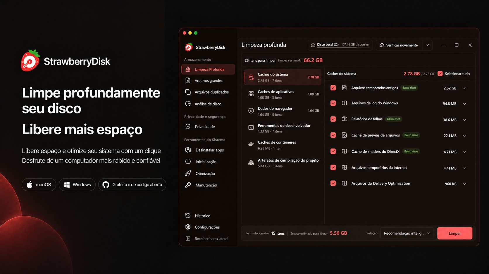
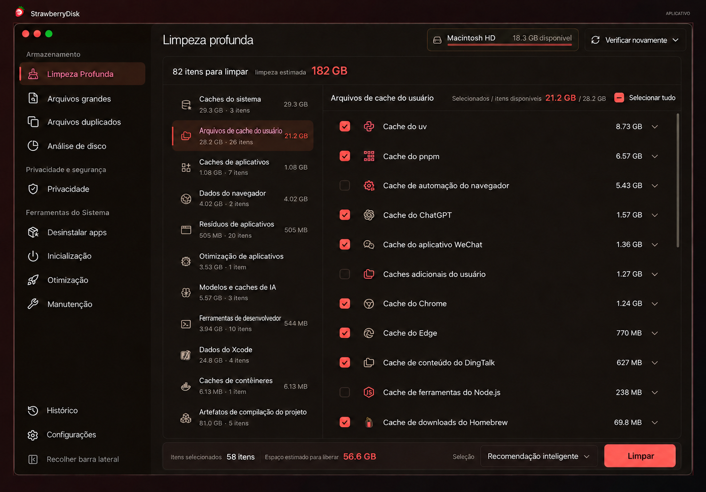
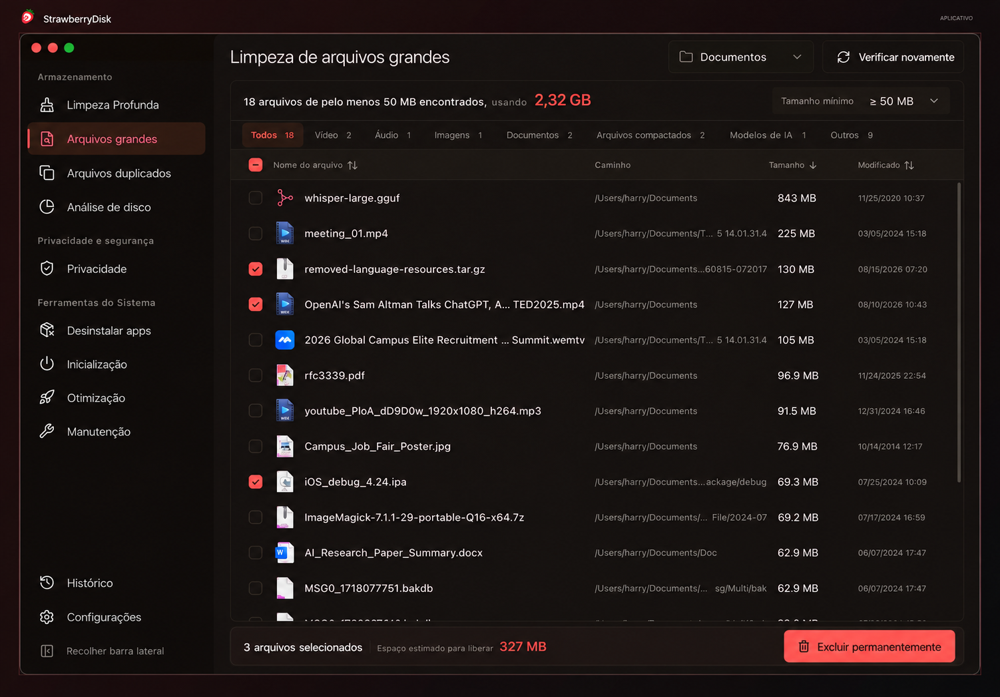
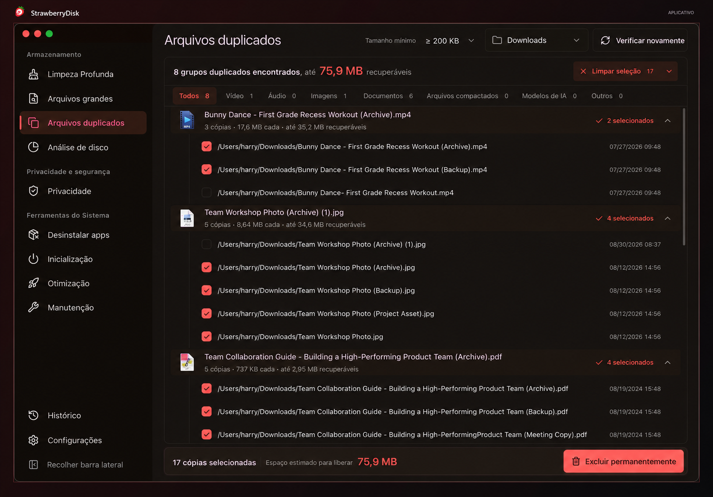
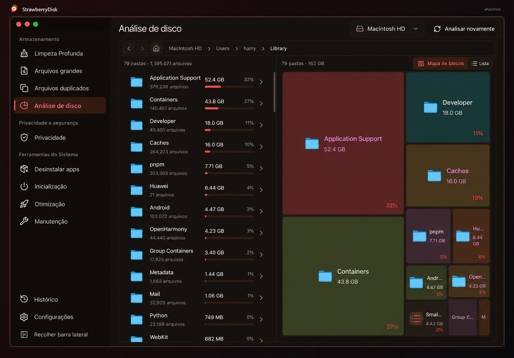
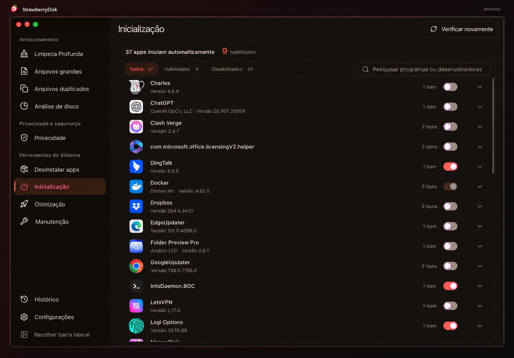
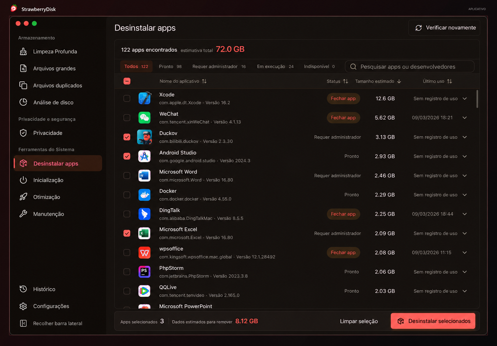
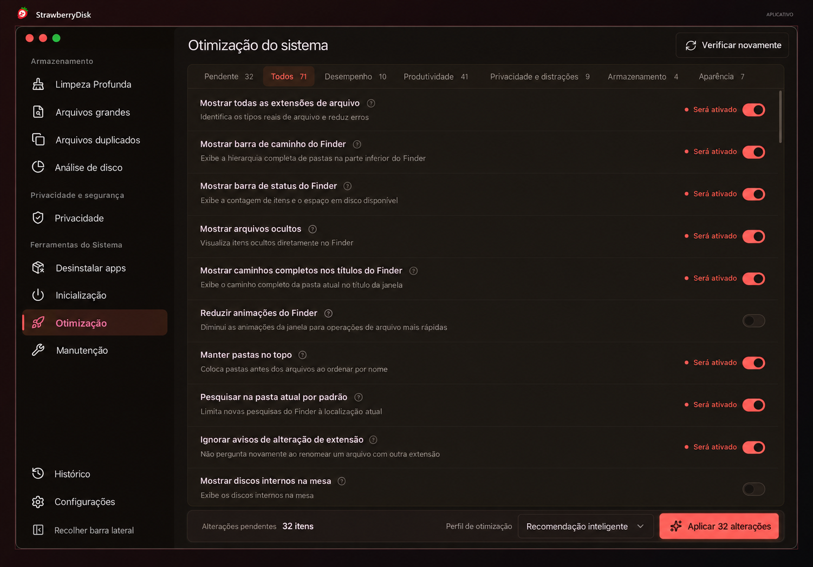
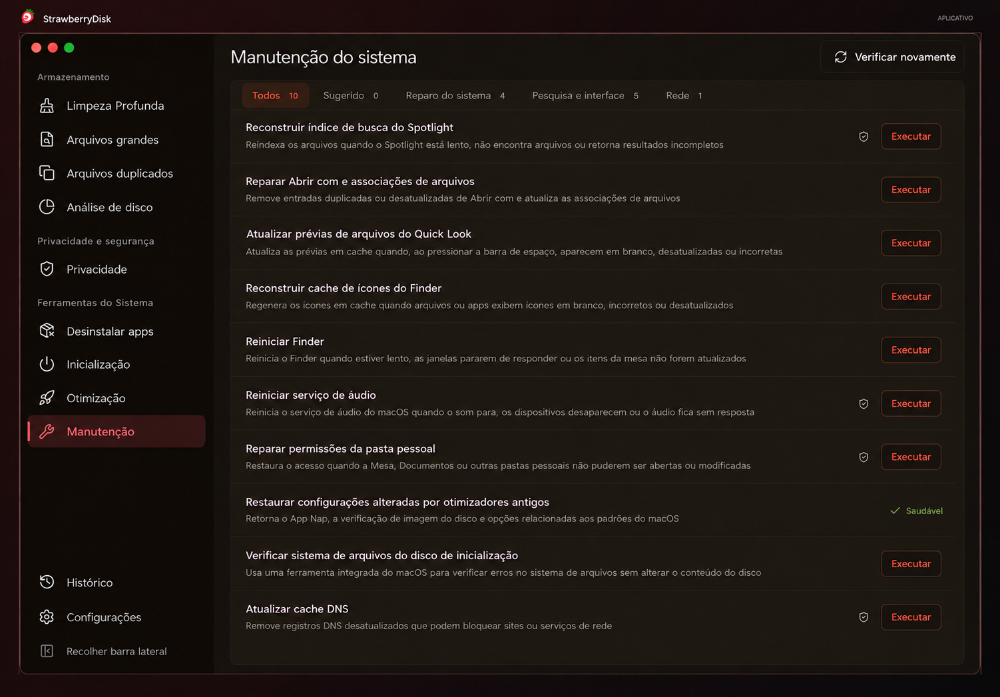
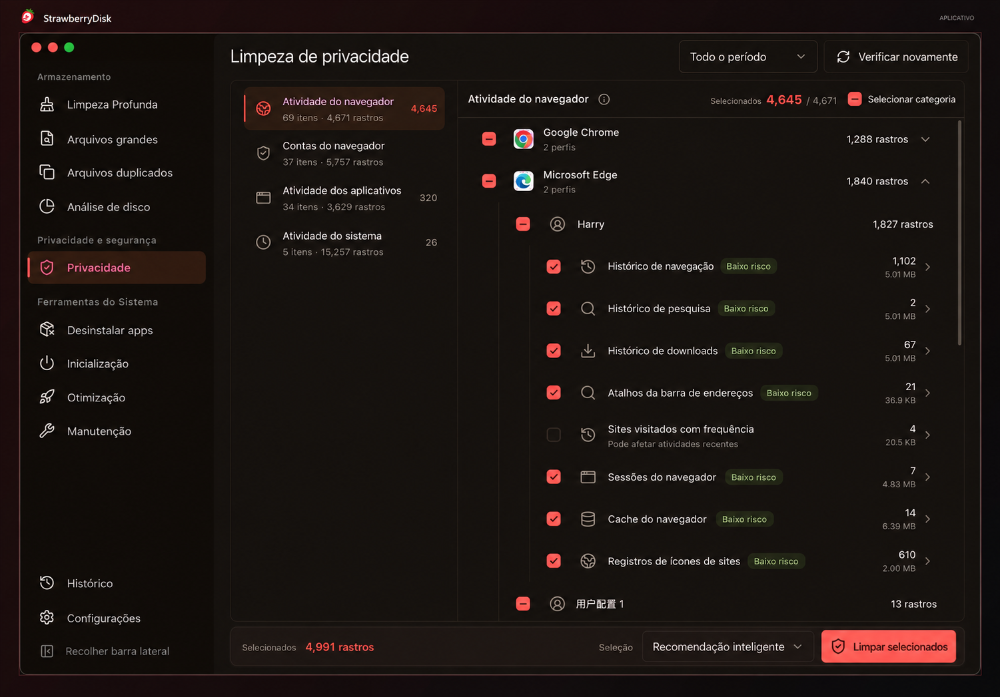

<h1 align="center">
   StrawberryDisk
</h1>

<p align="center">Limpeza de disco, análise de armazenamento e proteção da privacidade para <b>macOS</b>, <b>Windows</b> e <b>Linux</b></p>

<p align="center">
  Português (Brasil) · <a href="README.en.md">English</a>
</p>

<p align="center">
  <a href="https://github.com/Yeake0/StrawberryDisk-updates/releases/latest"></a>
  
  
  
</p>

<p align="center">
      
</p>

## O que o StrawberryDisk faz

> **Armazenamento**

### 1. Limpeza profunda

Encontre, em uma única análise, itens que podem ser limpos no sistema, nos aplicativos, nas ferramentas de desenvolvimento e nos projetos locais. O StrawberryDisk reúne os resultados pelo espaço que pode ser recuperado:

- **Caches do sistema e do usuário**: recupere o espaço ocupado por arquivos temporários, dados de diagnóstico e caches que podem ser recriados.
- **Caches de aplicativos**: evite que caches, logs, pacotes de atualização e arquivos temporários consumam cada vez mais espaço.
- **Dados de navegadores**: recupere o espaço usado por dados temporários e em cache do Chrome, Edge, Firefox, Brave, Arc, Opera e outros navegadores.
- **Ferramentas de desenvolvimento e Xcode**: recupere o espaço ocupado por gerenciadores de pacotes, IDEs, caches de compilação e dados de desenvolvimento do Xcode.
- **Caches de contêineres**: libere o espaço usado por caches de build inativos e dados recriáveis do Docker e de outras ferramentas de contêineres.
- **Artefatos de build de projetos**: recupere o espaço usado por dependências recriáveis, caches e diretórios de build de projetos Node.js, Rust, Gradle, Swift, Python, .NET, Godot, CMake e outros.
- **Modelos e caches de IA**: identifique modelos locais de IA grandes, caches de download e arquivos temporários de transferência.
- **Otimização de aplicativos**: reduza o espaço ocupado por aplicativos compatíveis sem afetar seu uso normal.

As recomendações ajudam você a tomar decisões seguras com rapidez. Também é possível revisar cada item e conferir a estimativa de espaço recuperável antes de limpar, mantendo o controle sobre a operação.

### 2. Limpeza de arquivos grandes

Encontre rapidamente os maiores arquivos e recupere o espaço ocupado por instaladores antigos, vídeos, arquivos compactados e outros conteúdos grandes, sem precisar vasculhar pasta por pasta.

### 3. Limpeza de arquivos duplicados

Recupere o espaço ocupado por cópias duplicadas sem considerar dois arquivos iguais apenas porque têm o mesmo nome. A seleção automática mantém pelo menos um arquivo em cada grupo para tornar a limpeza mais segura.

### 4. Análise do espaço em disco

Veja de imediato o que ocupa espaço no disco. Alterne entre um **mapa de árvore** e um **gráfico radial**, escolha quantos níveis deseja exibir e explore a estrutura das pastas. Navegue pelas pastas ao lado da lista de arquivos para encontrar os maiores itens e decidir o que limpar.

> **Privacidade e segurança**

### 5. Limpeza de privacidade

Remova históricos de navegação e pesquisa, cookies, itens recentes e dados da área de transferência que permanecem no computador. Limpe rastros deixados por navegadores, aplicativos e pelo sistema para reduzir a exposição das suas atividades.

> **Ferramentas do sistema**

### 6. Desinstalação e limpeza de aplicativos

Desinstale aplicativos e remova caches, configurações e resíduos relacionados para recuperar o espaço ocupado. Arquivos que possam ser pessoais são tratados com cautela para reduzir o risco de exclusão acidental.

### 7. Gerenciamento de itens de inicialização

Reduza atrasos desnecessários na inicialização e o uso de recursos em segundo plano. Você pode reativar os itens quando precisar deles novamente.

### 8. Otimização do sistema

Ajuste configurações que atrapalham o uso ou deixam o sistema mais lento. Equilibre desempenho, privacidade e preferências pessoais para usar o computador com mais facilidade.

### 9. Manutenção do sistema

Corrija problemas comuns, como resultados de pesquisa ausentes, ícones incorretos, falta de som ou falhas de conexão, sem procurar soluções nem digitar comandos complexos.

> **Atividade**

### 10. Histórico de operações

Consulte o registro de cada limpeza e alteração no sistema. Veja quanto espaço foi recuperado, quais operações foram concluídas e se alguma ainda precisa da sua atenção.

## Uso de recursos e gerenciamento de memória

> Disponível desde a versão 1.1.1

Confira o uso de CPU e memória, a velocidade da rede e a atividade do disco. Veja quais aplicativos consomem mais memória e libere memória com um clique quando os recursos estiverem escassos.

Mantenha essas informações na barra de menus, na barra de tarefas ou na bandeja do sistema, sem precisar abrir a janela principal.

## Explicações por IA

> Disponível desde a versão 1.1.0

Não sabe para que serve um item ou o que pode acontecer se alterá-lo? As explicações por IA usam a descrição do item e os resultados da análise atual para mostrar sua função e o que considerar antes de agir.

Consulte as explicações diretamente nos itens de Limpeza profunda (regras integradas), Limpeza de privacidade, Itens de inicialização, Otimização do sistema e Manutenção do sistema.

As versões oficiais incluem explicações gratuitas diárias e permitem conectar seu próprio serviço de IA. A IA oferece orientações; você decide quais ações executar.

## Segurança e regras

> [!IMPORTANT]
> **O StrawberryDisk prioriza a segurança dos dados.**
> Regras de limpeza e otimizações do sistema só são disponibilizadas após a definição clara dos seus limites de segurança e a validação em sistemas reais.

Por padrão, o StrawberryDisk faz análises somente de leitura. Antes de iniciar uma limpeza, exclusão, desinstalação ou alteração de configuração, você pode revisar e confirmar exatamente o que acontecerá. Os resultados são salvos no Histórico de operações.

A Otimização do sistema usa apenas configurações integradas e validadas. Ela não aceita caminhos arbitrários do Registro, comandos de terminal nem scripts. O StrawberryDisk verifica cada configuração após alterá-la e destaca itens de alto impacto e mudanças que exigem acesso de administrador ou reinicialização.

O StrawberryDisk mantém suas próprias regras de limpeza. Projetos de terceiros podem servir como ponto de partida para pesquisa, mas uma regra só é aceita após a verificação de fontes confiáveis, limites seguros e comportamento em sistemas reais. Regras sem limites claros de segurança são excluídas.

A biblioteca completa de regras e seu histórico de revisões podem ser consultados em [regras de limpeza do StrawberryDisk](https://github.com/Yeake0/StrawberryDisk/tree/main/src-tauri/crates/strawberrydisk-core/rules).

## Capturas de tela

As imagens abaixo foram adaptadas para português do Brasil a partir das capturas da interface. Elas podem diferir da versão atual do aplicativo.

<p align="center">
  <strong>Limpeza profunda</strong><br>
  <sub>Encontre itens que podem ser limpos no sistema, em aplicativos, ferramentas de desenvolvimento e projetos</sub>
</p>

<p align="center">
  
</p>

<table>
  <tr>
    <td width="50%" align="center">
      <strong>Limpeza de arquivos grandes</strong><br>
      <sub>Encontre os arquivos que mais ocupam espaço sem vasculhar pastas</sub><br><br>
      
    </td>
    <td width="50%" align="center">
      <strong>Limpeza de arquivos duplicados</strong><br>
      <sub>Remova duplicatas exatas com segurança, mantendo pelo menos uma cópia</sub><br><br>
      
    </td>
  </tr>
  <tr>
    <td width="50%" align="center">
      <strong>Análise do espaço em disco</strong><br>
      <sub>Veja o que ocupa espaço e encontre rapidamente os maiores arquivos e pastas</sub><br><br>
      
    </td>
    <td width="50%" align="center">
      <strong>Gerenciamento de itens de inicialização</strong><br>
      <sub>Reduza programas desnecessários na inicialização e a atividade em segundo plano</sub><br><br>
      
    </td>
  </tr>
  <tr>
    <td width="50%" align="center">
      <strong>Desinstalação e limpeza de aplicativos</strong><br>
      <sub>Desinstale aplicativos e remova resíduos relacionados para recuperar espaço</sub><br><br>
      
    </td>
    <td width="50%" align="center">
      <strong>Otimização do sistema</strong><br>
      <sub>Ajuste desempenho, privacidade e usabilidade com um clique</sub><br><br>
      
    </td>
  </tr>
  <tr>
    <td width="50%" align="center">
      <strong>Manutenção do sistema</strong><br>
      <sub>Corrija problemas comuns e volte a usar o computador normalmente</sub><br><br>
      
    </td>
    <td width="50%" align="center">
      <strong>Limpeza de privacidade</strong><br>
      <sub>Deixe menos rastros de atividade e proteja sua privacidade</sub><br><br>
      
    </td>
  </tr>
</table>

## Antes de começar

> [!CAUTION]
>
> 1. Operações de limpeza, exclusão permanente e desinstalação podem ser irreversíveis. Revise os itens selecionados e mantenha cópias de segurança dos dados importantes.
> 2. Antes de executar uma manutenção ou alterar um item de inicialização ou uma configuração do sistema, entenda sua finalidade e seu impacto.
> 3. Algumas otimizações podem afetar a segurança, a privacidade, a duração da bateria ou o funcionamento das atualizações.

## Aplicativo para desktop

O aplicativo oferece interface em português (Brasil) e inglês. Preferências salvas em outros idiomas passam para inglês após a atualização, sem alterar as demais configurações.

Baixe o instalador do StrawberryDisk para Windows x64 em [GitHub Releases](https://github.com/Yeake0/StrawberryDisk-updates/releases/latest).

### Windows

**Requisitos:** Windows 10 de 64 bits ou posterior.

**Instalação manual:** baixe o instalador para Windows na [página oficial](https://github.com/Yeake0/StrawberryDisk-updates/releases/latest) e siga as instruções na tela.

## Linha de comando (CLI)

A CLI pode ser compilada a partir do código-fonte. Ainda não há um instalador separado para esta versão.

### Exemplos de uso

Se o comando `strawberrydisk` não estiver disponível logo após a instalação, abra um novo terminal e verifique a instalação:

```sh
strawberrydisk --version
```

Comandos comuns:

```sh
# Analisar e mostrar itens que podem ser limpos sem alterar nada
strawberrydisk clean

# Aplicar as mesmas recomendações do aplicativo para desktop
strawberrydisk clean --apply

# Visualizar todos os itens selecionáveis sem excluir nada
strawberrydisk clean --apply --selection all --dry-run

# Produzir uma saída JSON legível por máquina
strawberrydisk clean --format json --no-progress
```

Por padrão, `strawberrydisk clean` apenas analisa e não modifica arquivos. Para executar a limpeza em um ambiente não interativo, você também precisa informar `--yes` para confirmar a ação. Consulte todas as opções com:

```sh
strawberrydisk clean --help
```

## Compilar a partir do código-fonte

### Atualizações desta versão pessoal

O repositório de desenvolvimento desta versão permanece privado. Os instaladores, o código-fonte correspondente a cada versão publicada e os metadados de atualização para Windows x64 ficam em [StrawberryDisk-updates](https://github.com/Yeake0/StrawberryDisk-updates). O botão de atualização consulta esse canal e instala somente versões assinadas com a chave desta versão pessoal. Ele não instala diretamente os executáveis do projeto original.

Não reutilize os nomes anteriores dos repositórios no GitHub: os redirecionamentos desses endereços permitem que instalações antigas encontrem o canal de atualização.

Para incorporar mudanças do projeto original, execute `scripts/prepare-upstream-update.ps1` em uma `main` limpa. O script compara o último commit importado em [`.upstream-source`](.upstream-source) com a versão atual, aplica as diferenças em uma branch de integração e cria um único commit no histórico do StrawberryDisk. Revise o resultado, resolva eventuais conflitos e execute as verificações obrigatórias antes de avançar a `main` e publicar um novo instalador. O histórico anterior à criação desta `main` está no branch `archive/pre-independent-main`; os avisos de origem estão em [`NOTICE.md`](NOTICE.md). O monitor semanal abre uma issue quando encontra mudanças no projeto original.

Antes de cada publicação, aumente a versão em `Cargo.toml`, `package.json` e `src-tauri/tauri.conf.json`. Gere o instalador com `createUpdaterArtifacts` habilitado e `TAURI_SIGNING_PRIVATE_KEY` apontando para a chave privada em `.local/updater.key`. Depois de enviar o commit correspondente ao repositório privado, execute `scripts/publish-windows-update.ps1`. O script publica o instalador, a assinatura, o `latest.json` e um ZIP do código-fonte extraído do mesmo commit no canal público. Faça uma cópia segura da chave privada; sem ela, os aplicativos já instalados não aceitarão novas atualizações desse canal.

A versão 1.1.6 foi distribuída antes da criação desse canal e ainda confia na chave do projeto original. É necessário instalar manualmente uma vez a versão 1.1.7 desta versão pessoal; a partir dela, o botão poderá receber as versões seguintes. Alterar futuramente o nome exibido do aplicativo não exige mudar seu identificador interno. Mantê-lo preserva o caminho de atualização e os dados existentes.

### Pré-requisitos

- Node.js 24 LTS
- pnpm 11.13.1
- Rust estável

Para dependências específicas de cada plataforma, consulte os [pré-requisitos do Tauri 2](https://v2.tauri.app/start/prerequisites/).

### Obter o código-fonte e executar o aplicativo

```sh
git clone https://github.com/Yeake0/StrawberryDisk.git
cd StrawberryDisk
pnpm install --frozen-lockfile
pnpm tauri:dev
```

### Executar as verificações obrigatórias

```sh
pnpm check
cargo test --manifest-path src-tauri/Cargo.toml -p strawberrydisk-core
```

### Gerar o instalador para desktop

```sh
pnpm tauri:build
```

### Compilar a CLI

```sh
pnpm cli:build
```

Compilações locais não incluem a assinatura, a notarização nem os metadados de atualização das versões oficiais do StrawberryDisk. Use-as apenas para desenvolvimento e validação locais.

## Como contribuir

Relatos de problemas, regras de limpeza, correções e novos recursos são bem-vindos. Leia [`CONTRIBUTING.md`](CONTRIBUTING.md) e [`AGENTS.md`](AGENTS.md) antes de começar.

A cobertura de limpeza rotineira deve usar regras TOML declarativas validadas durante a compilação. Consulte [`src-tauri/crates/strawberrydisk-core/rules/README.md`](src-tauri/crates/strawberrydisk-core/rules/README.md) para conhecer o esquema das regras, os limites de segurança e as instruções de validação.

Antes de enviar alterações, execute pelo menos:

```sh
pnpm check
cargo test --manifest-path src-tauri/Cargo.toml -p strawberrydisk-core
```

Comunique vulnerabilidades de segurança de forma privada pelo GitHub Security Advisories, conforme descrito em [`SECURITY.md`](SECURITY.md). Não abra uma issue pública para relatar uma vulnerabilidade.

## Tecnologias utilizadas

- [Tauri 2](https://tauri.app/): ambiente de execução para desktop e integração com o sistema
- [Rust](https://www.rust-lang.org/): análise, acesso ao sistema de arquivos, validação de segurança e execução da limpeza
- [Vue 3](https://vuejs.org/) e [TypeScript](https://www.typescriptlang.org/): interface do aplicativo para desktop

## Licença

O StrawberryDisk é um projeto de código aberto sob a [GNU General Public License v3.0](https://github.com/Yeake0/StrawberryDisk/blob/main/LICENSE). Componentes de terceiros continuam sujeitos às respectivas licenças. Consulte também os [avisos de autoria e origem](NOTICE.md).
